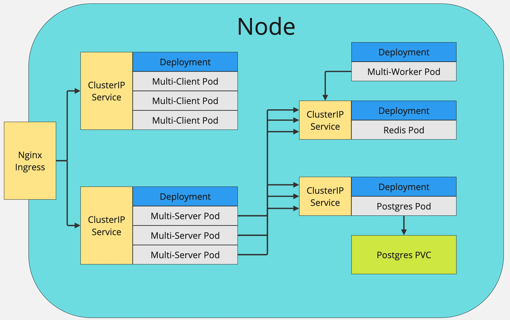

# Multi-Container Application on Kubernetes

## Introduction

This repository contains a multi-container application built using React for the frontend, Node/Express.js for the backend, Postgres for the database, and Redis for caching. The application is dockerized and deployed on a Kubernetes cluster. The internal communication between the services is handled through ClusterIP services, while an NGINX Ingress controller manages the external traffic. Persistent Volume Claims (PVC) are used for the Postgres database to ensure data persistence.

## Application Architecture

The application consists of the following components:

1. **Client (React):** The frontend of the application built using React.
2. **Server (Node/Express.js):** The backend of the application built using Node.js and Express.js.
3. **Worker (Node):** A worker service built using Node.js that listens to Redis for new values and performs the required computaions. 
4. **Postgres Database:** A Postgres database to store the application data.
5. **Redis Cache:** A Redis instance used for caching.


### Architecture Diagram



### Kubernetes Components

- **Deployments**: Each service (client, server, worker, Postgres, Redis) has its own Kubernetes deployment.
- **Services**: ClusterIP services are used for internal communication between the components.
- **Ingress**: NGINX Ingress controller is used to handle external HTTP/HTTPS traffic.
- **Persistent Volume Claims (PVC)**: Used for the Postgres database to ensure data is not lost if the pod restarts.

## Requirements

To run this application locally, ensure you have the following installed:

- Docker
- Kubernetes (Minikube or Docker Desktop with Kubernetes enabled)
- kubectl (Kubernetes command-line tool)
- Skaffold (optional, for streamlined development)


## Running the Application Locally

### Step 1: Clone the Repository

```sh
git clone https://github.com/siddharth-mavani/multi-k8s.git
cd multi-k8s
```

### Step 2: Create Kubernetes Secret for Postgres

Before applying the Kubernetes manifests, create a secret for the Postgres password:

```sh
kubectl create secret generic pgpassword --from-literal PGPASSWORD=12345asdf
```

### Step 3: Deploy to Kubernetes

1. **Start Minikube (if using Minikube)**

   ```sh
   minikube start
   ```

   If you are using Docker Desktop with Kubernetes enabled, you can skip this step. Just ensure your Kubernetes context is set to the correct cluster.

2. **Deploy NGINX Ingress Controller**

   Install the NGINX Ingress controller by running the following command.

   ```sh
   kubectl apply -f https://raw.githubusercontent.com/kubernetes/ingress-nginx/controller-v1.10.1/deploy/static/provider/cloud/deploy.yaml
   ```


3. **Apply Kubernetes Manifests**

   Apply all the Kubernetes manifests from the `k8s` directory.

   ```sh
   kubectl apply -f k8s/
   ```

### Step 4: Access the Application

If using Minikube, get the Minikube IP address:

```sh
minikube ip
```

Access the application through the browser using the Minikube IP and the configured port. If using Docker Desktop, you can access the application using `localhost`.

## Optional: Using Skaffold for Development and Deployment

Skaffold is a command-line tool that facilitates continuous development for Kubernetes applications. It handles the build, push, and deploy steps automatically.

### Step 1: Install Skaffold

Follow the installation guide for Skaffold: https://skaffold.dev/docs/install/

### Step 2: Run Skaffold

Ensure you have a `skaffold.yaml` configuration file in your project root. Run the following command to start the Skaffold process:

```sh
skaffold dev
```

Skaffold will monitor your source code for changes, rebuild the images, and redeploy the application automatically.

---

## Additional Resources

- [Kubernetes Documentation](https://kubernetes.io/docs/home/)
- [Minikube Documentation](https://minikube.sigs.k8s.io/docs/)
- [NGINX Ingress Controller](https://kubernetes.github.io/ingress-nginx/deploy/#quick-start)
- [Skaffold Documentation](https://skaffold.dev/docs/)
- [Docker Documentation](https://docs.docker.com/)